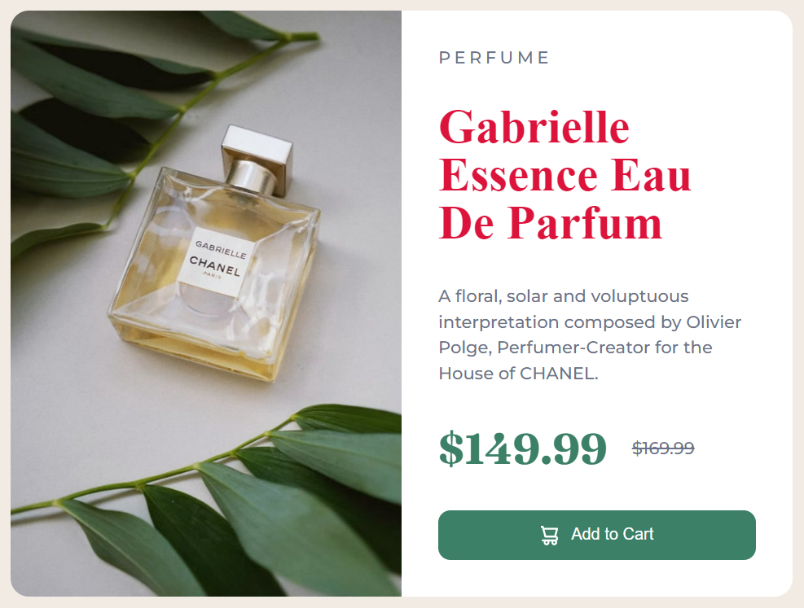

# task-1


## solution
```
const title = document.querySelector('.caption .title');
title.style.color = 'hsl(0deg 83% 49%)';
```

# task-2


## solution
```
const head = document.getElementsByTagName('head');
const style = document.createElement('style');
const css = `.add-to-cart:hover{background-color:#e50d0d;}`;
style.appendChild(document.createTextNode(css));
console.log(style);
console.log(head);
head[0].appendChild(style);
```
